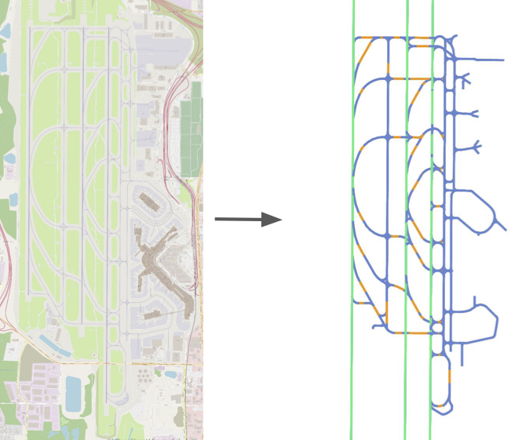

# AmeliaMaps

## Overview

[AmeliaMaps](http://ameliacmu.github.io/): Tool for creating vectorized context graphs for intent prediction. It takes the limit of the airport in the form of a `.json` file and the `.osm` file of the airport as input and generates a graph in the form of a `.osm` file and the corresponding `.pkl` file. The graph is a dictionary with the keys as the node ids and the values as the node attributes. The node attributes contain the coordinates of the node, the type of the node, and the edges connected to the node. The edges are represented as a list of tuples where each tuple contains the id of the connected node and the distance between the two nodes.

<div align="center">
  
  <h5>Example of the airport processing pipeline.</h5>
</div>

The main goal is to simplify the graph to contain only the relevant information for the movement areas of the airport. From the raw `OSM` data to the processed graph.

<div align="center">
  
  <h5> Example of th KSEA airport map and the processed `.osm`</h5>
</div>

For visualizing the simplification process you can use the [semantic_graph notebook](semantic_graph.ipynb) to see the effect of each step in the graph. Currently, the sanitize function only keeps the largest subgraph, so make sure all the relevant movement areas are fully connected.

## Pre-requisites

### Dataset

To run this repository, you first need to download the amelia dataset. Follow the instructions [here](https://github.com/AmeliaCMU/AmeliaScenes/DATASET.md) to download and setup the dataset.

Once downloaded, create a symbolic link into  `datasets`:

```bash
cd datasets
ln -s /path/to/the/amelia/dataset .
```

The dataset folder should contain the following structure:

```bash
datasets
├── amelia
│   ├── assets
│   │   ├── airport_code
|   |   |    ├── airport_code.osm
|   |   |    ├── limits.json
```

### Manual pre-processing

When using this tool with airports downloaded from OSM, these need to have certain characteristics to be compatible with the processing script.

- Runways must be grouped in a single edge. There can be multiple nodes on the runway, but these must be grouped in one single way.
- Runway end nodes cannot be connected "laterally" to taxiways or holdlines. This is because the centerlines will be extended. If a ramp connects to the end of the runway, insert a surrogate node below it.
- Edges must contain aeroway keys indicating the type of zone, i.e. `aeroway: taxiway`. Hold lines nodes must have the equivalent tag `aeroway : holding_position`.

For the amelia dataset, the airports have been pre-processed to meet these requirements. The `limits.json` file contains the bounding box of the airport and the `airport_code.osm` file contains the OSM data of the airport.

### Installation

This repository can be installed following the instructions [here](https://github.com/AmeliaCMU/AmeliaMaps/INSTALL.md). However, we recommend to setup all of our Amelia Framework tools. You can do so following the instructions [here](https://github.com/AmeliaCMU/AmeliaScenes/INSTALL.md).

## How to use

### Graph processing

After simplifying the desired `.osm` file manualy (in the case of amelia it is already done), use the `graph_processor.py` tool to generate the corresponding pickle file containing the polyline dictionary for the graph. Run the following command:
MapProcessor

```bash
python amelia_maps/graph_processor.py  --airport [airport] --base_dir [base_dir] --out_dir [out_dir] --save --show
```

Where:

- `[airport]` is the ICAO code of the airport you want to process. It can be one of the following: `kbos`, `kdca`, `kewr`, `kjfk`, `klax`, `kmdw`, `kmsy`, `ksea`, `ksfo`, `panc`. By default, it is set to `KBOS`.
- `[base_dir]` is the base directory where the airport files are located. By default, it is set to `./datasets/amelia`.
- `[out_dir]` is the directory where the processed files will be saved. By default, it is set to `./out`.
- `--save` flag to save the processed airport data. The output files are `.pkl` `.osm` and a `.png`.
- `--show` flag to show the processed graph. By default it is set to `False`

#### Example usage

This command will process the Boston Logan International Airport (KBOS) and save the processed files in the `./out` directory.

```bash
python amelia_maps/graph_processor.py  --airport kbos --base_dir ./datasets/amelia --out_dir ./out --save
```

#### Expected outputMapProcessor

The output files will be saved in the `./out` directory. The files are:

```bash
out
├── kbos
│   ├── semantic_graph.pkl
│   ├── semantic_kbos.osm
│   ├── semantic_graph.png
```

### Code details

#### The MapProcessing Class

For processing the OSM files obtained from public sources, use `MapFromNet` found [here](amelia_maps/graph_processor.py).

Each of the steps in the processing pipeline is separated into methods of the class. All these methods affect the graph attribute of the class.

### MapFromNet.preprocess_map(extension_distance = 1609, supersample_value = 80, save = True, show = False, verbose = True)

Contains the predefined routine for simplifying the routing graphs. The method takes the following parameters:

- `eMapProcessoristance`: Distance in meters to extend runway endpoints. The default is `1,609`, equivalent to `1` nautical mile.
- `supersample_value`: Value MapProcessorto supply to the supersampling method. Note that the supersampling threshold and node spacing are the same for consistency in the processed graph.
- `save`: flag for toggling saving the processed graph in XML format.
- `show`: flag for toggling plotting the processed graph.
- `verbose`: If set to true, it displays a statistic summary of the processed graph.

#### MapFromNet.map_to_polylines()

Once the map has been preprocessed, it can be converted to vectorized form and stored as a pickle file using this method.

#### MapFromNet.semantify_nodes()

Given the raw graph, search the nodes for relevant aeroway tags and classify important nodes.

#### MapFromNet.get_routing_graph()

Classifies the relevant centerlines for movement areas and removes unnecessary edges. Runway endpoint nodes are stored in the `MapFromNet.runway_pairs` attribute. Consecutive elements in this list represent the pair of endpoints for a given runway.

#### MapFromNet.extend_runways(extension_distance)

Displaces all runway endpoints by the specified amount following the slope of the runway. It takes in the following parameter:

- `extension_distance`: Distances in meters to extend runway endpoints. The default is 1,609, equivalent to 1 nautical mile

#### MapFromNet.sanitize()

Removes all nodes with default class (`node_type == 0`) and keeps only the largest subgraph. This assumes the movement area of the airport is a fully connected graph.

#### MapFromNet.supersample_graph(thr, node_separation)

Identifies edges below the specified threshold and supersamples them, placing a node every specified meters. The method takes the following parameters:

- `thr`: Minimum length, in meters, of an edge to be supersampled.
- `node_separation`: separation in meters between the placed nodes.

#### MapFromNet.display_and_save(save, show)

Displays the graph found in `MapFromNet.graph` with the semantic colors. This requires the nodes to have a node_type attribute. The method takes the following parameters:

- `save`: Flag to save the graph in XML format. The graph is saved under `[out_dir]/[airport]/semantic_[airport].osm`

## BibTeX

Our paper:

**Amelia: A Large Dataset and Model for Airport Surface Movement Forecasting [[paper](https://arxiv.org/pdf/2407.21185)]**

If you find our work useful in your research, please cite us!

```bibtex
@inbook{navarro2024amelia,
  author = {Ingrid Navarro and Pablo Ortega and Jay Patrikar and Haichuan Wang and Zelin Ye and Jong Hoon Park and Jean Oh and Sebastian Scherer},
  title = {AmeliaTF: A Large Model and Dataset for Airport Surface Movement Forecasting},
  booktitle = {AIAA AVIATION FORUM AND ASCEND 2024},
  chapter = {},
  pages = {},
  doi = {10.2514/6.2024-4251},
  URL = {https://arc.aiaa.org/doi/abs/10.2514/6.2024-4251},
  eprint = {https://arc.aiaa.org/doi/pdf/10.2514/6.2024-4251},
}
```
